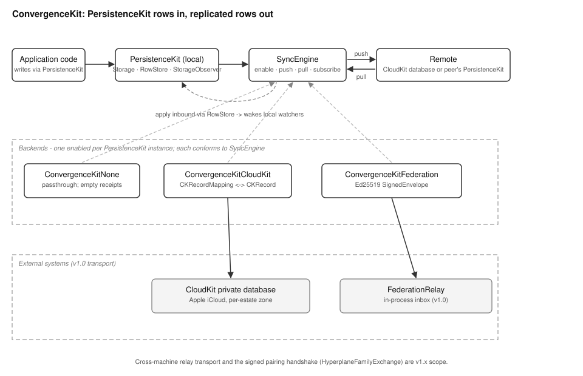

# ConvergenceKit Overview

## Current Release Notes

CloudKit last-writer-wins now stores sync HLC data in `_ck_sync_meta`.
The app row stays clean.
The side table lets the engine compare remote HLC values across all backends.
It checks the remote row before it applies an inbound write.

## What This Library Does

ConvergenceKit copies rows between devices and between estates. PersistenceKit
is the package that stores those rows on one device. An estate is one user's
complete memory store in MOOTx01. Estates can federate. Federation means two
separate estates share and compare memories.

ConvergenceKit sits beside PersistenceKit. It watches for changes there. It
ships each change somewhere else. The destination is one of two places.
The first is another of the user's own devices, through Apple's CloudKit.
The second is a different user's estate, through a peer-to-peer exchange.
The SDK calls this second path federation.

Application code never calls ConvergenceKit's sync methods for ordinary reads
and writes. It writes to PersistenceKit as usual. A host configures
ConvergenceKit once, alongside PersistenceKit, to observe that same storage.
After that, replication is a side effect of normal writes. It is not a task
the application must remember to perform.

## The Problem It Solves

A memory captured on one device is useless on another device until it
travels there. Two hard problems stand between "captured here" and
"visible there."

The first problem is conflicting writes. A row can change on two devices
before they synchronize. Something must then decide which change wins.
ConvergenceKit answers this with a per-table conflict policy. The application
declares this policy once, in advance. The default policy is
`lastWriterWinsByHLC`. It settles conflicts with a Hybrid Logical Clock
(HLC). An HLC is a timestamp. It combines a device's wall-clock reading with
a small counter. This lets two devices order their changes consistently,
even when their clocks are not perfectly synchronized. Three other policies
cover cases where last-writer-wins is wrong. `appendOnly` suits audit logs
that must never overwrite an entry. `localWins` suits data a device should
never let a peer overwrite. `remoteWins` covers the opposite case.

The second problem is trust. Federated sync crosses a perimeter between two
separate people's estates. A receiving device must be able to prove two
things about an incoming batch of changes. It must prove the batch came from
the peer it paired with. It must prove no one altered the batch in transit.
ConvergenceKit answers this with Ed25519 signatures. Ed25519 is a public-key
signature scheme. Each estate generates a private key it never shares. Each
estate also hands out a public key to peers during pairing. Every batch of
changes is signed with the sender's private key before it leaves the device.
The receiver checks that signature with the sender's public key before it
applies anything.

CloudKit sync does not need this second protection. It stays inside one
person's Apple account. Apple's own private database already authenticates
it. Federated sync crosses to a stranger's device instead. It needs its own
authentication, independent of any platform account system.

## How It Works

ConvergenceKit defines one protocol, `SyncEngine`. Three backends conform to
it: `NoSyncEngine`, `CloudKitSyncEngine`, and `FederationSyncEngine`. An
application picks exactly one backend per PersistenceKit instance. All three
backends expose the same four operations. Application code that calls them
does not need to know which backend is active.

`enable(manifest:storage:)` turns sync on. A `SyncManifest` is a
declaration. The application writes it once. It states which
PersistenceKit tables to sync. It states the direction for each table:
`bidirectional`, `pushOnly`, or `pullOnly`. It states the conflict policy
for each table. Enabling a backend also starts it watching
PersistenceKit's `StorageObserver`. It watches for local inserts, updates,
and deletes on every table the manifest lists as push-eligible.

`push()` sends pending local changes outward. It returns a `SyncReceipt`
summarizing what moved. `pull()` fetches pending remote changes. It applies
them through PersistenceKit's own write path. This is what makes the
receiving side work correctly. An applied row is not a special sync
artifact. It is an ordinary row. Anything already watching PersistenceKit
notices the change the normal way. `subscribe()` returns a live stream of
`SyncEvent` values for a user interface to display. These events cover
changes applied, pushes completed, peers connecting, peers disconnecting,
and errors.

Every backend that crosses a real network boundary needs a wire format for
a changed row. `SyncRecord` is that format. It carries a table name, an
event kind, a row key, the changed column values, an HLC, a schema
version, and a kit identifier. The schema version and kit identifier let a
receiver reject a record it does not understand. This is safer than
misapplying that record. `SyncRecord` is Codable with explicit coding
keys. The SDK maintains a Rust port of large parts of the system. Both
ports must produce the same JSON field names for the same data.

## How the Pieces Fit

Figure 1 shows the library's topology. The shared protocol and wire format
sit at the center. PersistenceKit sits on either end. The three backends
appear as interchangeable implementations in between.

*Figure 1. Topology of ConvergenceKit. Application code writes only to
PersistenceKit. Whichever backend is enabled observes those writes and ships
them outward. On the receiving side, applying an inbound change routes back
through PersistenceKit's normal write path. Dashed regions mark the three
interchangeable backends and the external systems each one talks to: CloudKit's
private database and the federation relay.*

`NoSyncEngine` is the simplest backend. It accepts `enable()`. It then
returns empty receipts from `push()` and `pull()` forever. It exists for
single-device deployments, development, and tests. Wiring in a real backend
in those cases would add cost without adding value.

`CloudKitSyncEngine` replicates rows through Apple's CloudKit private
database, using one CloudKit zone per estate. `CKRecordMapping` is the piece
that makes this backend generic instead of hand-written per table. It
converts any PersistenceKit row into a `CKRecord`, and back again, driven
entirely by the table name and the manifest. Adding a new synced table
never requires new mapping code.

`FederationSyncEngine` replicates rows to a different user's estate. Two
engines "pair" by exchanging Ed25519 public keys. They also exchange a
shared `HyperplaneFamilySpec`. This is a parameter that lets both sides
compare certain 256-bit fingerprints on equal terms after pairing. A
fingerprint here is a short, fixed-size code computed from content. Once
paired, every pushed batch of `SyncRecord` values gets wrapped in a
`SignedEnvelope`. The engine signs that envelope and hands it to a `Relay`.
At v1.0, the shipped `Relay` implementation is `FederationRelay`. It is
in-process only. It holds pending messages in memory for peers running in
the same process. This is enough to exercise the full protocol in tests,
including signature verification and conflict resolution. A wire transport
that reaches a peer on a different machine is future work.

## What Ships in the Package

The package ships four Swift targets. `ConvergenceKit` holds the protocol,
the wire format, and the shared types. `ConvergenceKitNone`,
`ConvergenceKitCloudKit`, and `ConvergenceKitFederation` hold the three
backends. A `rust/` port mirrors the core types, the wire format, and the
None and Federation backends. CloudKit is Apple-only by design, so it has no
Rust equivalent. The Swift side always handles that transport. Every field
name shared between the two ports is pinned in code comments. Tests on both
sides exercise those names, because a receiver on one port must decode a
record written by the other exactly.
