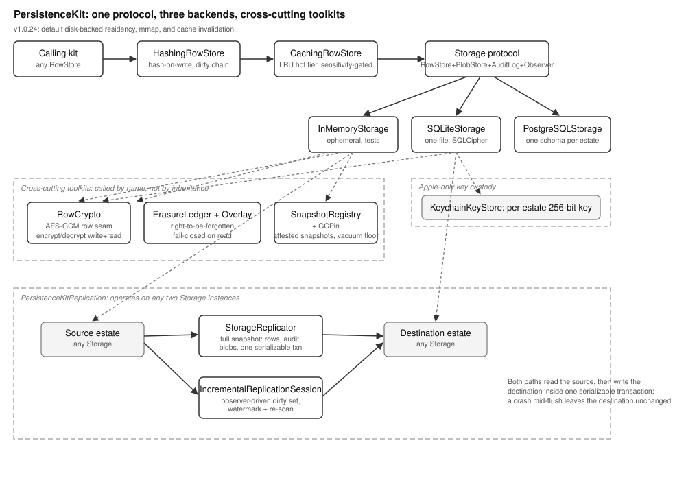

# PersistenceKit Overview

## Current Release Notes

PersistenceKit now carries a `residencyHint` on `EstateConfiguration`.
The default is `.diskBacked`.
SQLite and the OS page cache manage large indexes in that mode.
`.ramResident` keeps the old heap-cached behavior for tests and small stores.

The release hardens storage.
SQLite database files are set to owner-only permissions.
Key PRAGMA errors no longer echo key material.
Transaction commits now clear present-read cache entries.

The storage contract now includes `DatasetStore`.
It creates typed user tables with safe column names.
It supports bulk append, filtered query, column stats, and table drop.
SQLite, PostgreSQL, and in-memory backends implement the same surface.
Text comparison uses UTF-8 byte order across every backend and language.

## What This Library Does

PersistenceKit is the storage layer for MOOTx01. MOOTx01 is an on-device
AI memory system. It stores what an AI observes over time. It later
helps the AI recall what it observed. Every fact, drawer, and audit
record a MOOTx01 estate keeps passes through PersistenceKit first. Only
then does the record reach a disk or a database. An estate is one
user's complete memory store in MOOTx01. PersistenceKit does not decide
what a memory means. That job belongs to a higher kit. PersistenceKit
decides how a memory is written, read, and kept safe. It takes over
once another kit hands the memory over as typed rows and bytes.

PersistenceKit gives every higher kit the same core operations. A kit
can insert a row. A kit can fetch a blob. A kit can append an audit
event. A kit can watch a table for changes. It can also manage typed
user datasets. This holds true no matter
which physical engine sits underneath. The engine can be SQLite on a
phone. It can be PostgreSQL on a shared server. It can also be a plain
in-memory table for a unit test. The calling kit writes the same code
in every case.

## The Problem It Solves

MOOTx01 runs in more than one place. A single estate might live only
on one iPhone. It might instead run against a shared PostgreSQL server
for a managed deployment. It might exist only for the length of a
test. Without a storage abstraction, every kit that touches memory
would need to know three different database APIs. Each API brings its
own quirks. Worse, a kit built against SQLite could not point at
PostgreSQL without a rewrite.

PersistenceKit solves this with one typed contract: the `Storage`
protocol. Three backends satisfy that contract: `PersistenceKitSQLite`,
`PersistenceKitPostgreSQL`, and `PersistenceKitInMemory`. A caller writes
against `Storage`, `RowStore`, `BlobStore`, and `AuditLog` exactly once.
Swapping the backend then means changing one line of configuration. The
calling code itself never changes.

One interface across three engines is still not enough on its own.
Real deployments also need at-rest encryption. They need tamper-evident
audit trails. They need safe deletion of sensitive content. They need a
cache that never lies about what storage truly holds. They need a way
to copy an entire estate from one backend to another. PersistenceKit
builds all of these as layers on top of the same four-operation core.
A kit that only needs plain rows never pays for features it does not
use. A kit that needs encryption or replication gets it without
leaving the same protocol surface.

PersistenceKit deliberately does not own vector similarity search. A
separate library, VectorKit, owns dense-embedding nearest-neighbor
search instead. PersistenceKit's job toward that workload stays narrow.
Every backend must support the storage needs a vector index has. It
must store a vector payload in a row. It must read many rows back in
bulk. It must count rows and delete rows. Call this the accommodation
contract.
PersistenceKit accommodates the workload. It does not implement the
search itself.

## How It Works

One protocol sits at the center of the library: `Storage`. A type
conforms to `Storage` by providing four sub-stores. `RowStore` handles
typed rows. `BlobStore` handles raw bytes keyed by string. `AuditLog`
keeps an append-only history of changes. `StorageObserver` delivers live
change notifications. A conforming type also manages schema and
transactions. `EstateConfiguration` tells a `Storage` implementation
which backend to open. It also sets the encryption mode and the cache
settings to use.

A schema in PersistenceKit is not raw SQL. It is a typed Swift value
called `SchemaDeclaration`, built from `TableDeclaration` and
`ColumnDeclaration` values. A kit that wants to store data describes
its tables once, as Swift structs. Each backend then translates that
description into its own native form. SQLite gets `CREATE TABLE`
statements. PostgreSQL gets `CREATE TABLE` statements in its own
dialect. The in-memory backend just allocates a dictionary. Queries
follow the same pattern. `StoragePredicate` is a closed tree of
comparison and bitmap operators. Each backend compiles that tree to its
own query language. No caller ever writes a raw SQL string.

Three backends satisfy `Storage`. `PersistenceKitSQLite` is the
on-device engine. It uses one file per estate, encrypted at rest
through a vendored SQLCipher build when an estate asks for
whole-database encryption. `PersistenceKitPostgreSQL` is the server
engine, built on the `postgres-nio` client. It gives each estate its
own PostgreSQL schema, so many estates can share one database server
without their tables colliding. `PersistenceKitInMemory` is the test
and prototyping engine. It keeps no file and opens no network
connection, and it disappears when the process exits.

The core protocol also carries decorators and free-function toolkits.
Any backend can use these without changing its own code.

- `CachingRowStore` wraps a `RowStore` with an in-memory hot tier. Rows
  above a configured sensitivity level are never cached. The cache
  guarantees that every read returns exactly what the backing store
  would return. Caching only changes speed, never correctness.
- `HashingRowStore` wraps a `RowStore` and computes a content hash on
  every write to a table marked hashable. It then reports the write up
  a parent chain, so a Merkle-style integrity tree can stay current
without a full rescan.

`DatasetStore` is a separate shaped surface on each backend.
Each dataset gets one table derived from its UUID.
User column names pass one strict identifier gate.
Queries reuse the normal predicate and ordering types.
- `RowCrypto` and its write and read seam functions apply per-row
  AES-GCM encryption to a table's `content` column. This runs whenever
  an estate is configured for row-level encryption, independent of
  whichever backend stores the row.
- `ErasureLedger` and `ErasureOverlay` implement right-to-be-forgotten
  deletion. The ledger records that a piece of content was erased. The
  overlay nulls that content out of every read afterward. It fails
  closed, dropping the row, if the erasure check itself cannot
  complete.
- `SnapshotRegistry` and `GCPin` let a kit take a named, attested
  snapshot of the estate's state. They also pin the oldest live
  snapshot's timestamp, so a later garbage-collection pass never
  deletes data a snapshot still needs.
- `PersistenceKitReplication` copies an entire estate's rows, audit
  events, and blobs from one `Storage` to another. It can run this
  copy as a one-shot full snapshot or as an incremental sync driven by
  a live change-observation session.

## How the Pieces Fit

Figure 1 shows the library's topology. It shows the major parts and
how a write or a read moves between them.

*Figure 1. Topology of PersistenceKit. A calling kit reaches storage
only through the four core protocols. Decorators wrap a backend's
`RowStore` transparently. Cross-cutting concerns sit beside the core
surface. Examples include encryption, erasure, and snapshots. Each is
invoked by name, not by inheritance. Replication reads one `Storage` and writes
another. Dashed regions mark backend-owned engines and the
cross-process encryption key store.*

A typical write enters through a kit-held reference to `any RowStore`.
If the estate has caching enabled, that reference is really a
`CachingRowStore` wrapping the real backend's row store. If hash-on-write
is also configured, a `HashingRowStore` may sit in front of that. The
write descends through zero or more decorators until it reaches the
concrete backend: `SQLiteRowStore`, `PostgreSQLRowStore`, or
`InMemoryRowStore`. That backend applies the row-encryption seam, a
no-op unless the estate uses row encryption. It checks the
content-and-keyID invariant. It validates every SQL identifier it is
about to interpolate. It then commits the row. Every backend notifies
its `StorageObserver` afterward. Decorators, cache invalidators, and
replication sessions downstream can then react.

A typical read follows the same path in reverse, with one addition.
Any content subject to the right-to-be-forgotten contract passes
through `ErasureOverlay.apply(...)` after the backend query returns. An
erased row's content columns then come back `nil`. The row's skeleton
still survives for referential integrity. The skeleton is its ID,
timestamps, and lattice anchors.

Encryption, erasure, and snapshots are not separate storage engines.
They are pure functions and small actors that any backend calls at the
right moment. `encryptedForWrite` and `decryptedForRead` run around a
write or a read. `ErasureLedgerOps.isErased` runs inside the overlay.
`GCPin.minimumRetainableHlc` runs before a vacuum. This design keeps
the cross-cutting logic in one place, the `PersistenceKit` core,
instead of duplicating it inside every backend. It is also why the
SQLite and PostgreSQL backends produce byte-compatible encrypted
envelopes. Both call the same `RowCrypto` code.

## What Ships in the Package

The package ships five Swift targets. `PersistenceKit` is the core. It
holds the `Storage`, `RowStore`, `BlobStore`, `AuditLog`, and
`StorageObserver` protocols. It holds the typed value and predicate
algebra, the schema declarations, and the caching and hashing
decorators. It also holds the encryption, erasure, snapshot, and
telemetry toolkits. `PersistenceKitInMemory` is the test backend.
`PersistenceKitSQLite` is the on-device backend, built against a
vendored `SQLCipher` C target. Whole-database encryption never depends
on the host operating system's own SQLite because of this.
`PersistenceKitPostgreSQL` is the server backend, built on `postgres-nio`
and `NIOSSL`. `PersistenceKitReplication` is the estate-copying
primitive. It depends only on the core protocol surface, so it works
against any pair of conforming backends.

The package also ships a Rust port in `rust/`. That port mirrors the
same trait surface. It mirrors the same closed predicate algebra. It
mirrors the same three backends. It exists for use outside the Swift
and Apple ecosystem. The two ports share design intent. They are not
conformance-gated against each
other the way LatticeLib's two legs are. PersistenceKit's cross-platform
contract is the shared protocol shape and wire format. It is not a
promise of byte-identical output from a shared corpus.
