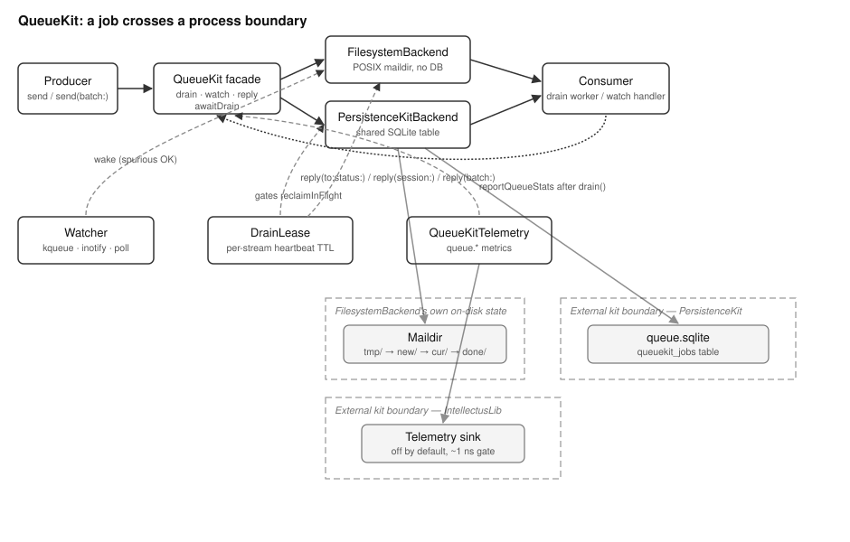

# QueueKit Overview

## Current Release Notes

Queue telemetry now separates sampling from emission.
The latency window records every drain tick.
Metrics are emitted at most once every 30 seconds for each estate stream.
This keeps dashboards useful without filling the telemetry store.

## What This Library Does

QueueKit is a general-purpose work queue. It lets one part of MOOTx01 hand a
unit of work to another part. The two parts need not run in the same
process. They need not even run at the same moment.

MOOTx01 is an on-device AI memory system. It stores what an AI observes over
time. It helps the AI recall that record later. Many of its jobs are best
done off to the side, by a separate worker. Encoding a memory is one
example. Running a dreaming pass over the estate is another. Replaying a
signal is a third. Handing off this work means the part of the system that
noticed it does not have to wait for it to finish.

QueueKit is a Kit. A Kit is a larger package that composes libraries into a
subsystem. A kit may depend on a library. A library never depends back on a
kit. QueueKit lives in moot-system, the repository that houses the kits that
hold MOOTx01 together at the system level.

The unit of work is called a `Job`. A job carries an identifier, the name of
the stream it belongs to, and a submission timestamp. It also carries a
priority and an arbitrary payload of bytes. A producer calls `send` to hand
a job to the queue. A consumer calls `drain` to claim available jobs. The
consumer does the work, then calls `reply` to mark each job finished.
QueueKit exposes exactly four permanent methods for this cycle: `send`,
`drain`, `watch`, and `reply`. Every backend supports all four the same way,
no matter which storage mechanism sits underneath it.

## The Problem It Solves

Handing work across a process boundary is harder than it looks. Three
requirements make it hard. QueueKit exists to meet all three at once.

First, the handoff must survive a crash. The producing process might die
partway through. The queue itself might die. The consuming process might
die. In every case, no job may be lost without a trace, and no job may be
claimed twice at once. A job is claimed exactly once at a time. A completed
job leaves a durable record of how it finished.

Second, independent workloads must not interfere with each other while they
share one queue. An encode worker and a dreaming worker might both draw from
the same estate's queue. Neither should be able to claim, or block on, the
other's jobs. QueueKit calls a workload a stream. Every operation has a
stream-scoped form, so consumers can share one queue without stepping on
each other.

Third, the format on disk or in the database must mean the same thing no
matter which programming language wrote it or read it. MOOTx01 ships Swift
code for Apple devices. It ships Rust code for cross-platform daemons and
services. It ships Python code for command-line tooling. A job enqueued by
one language's producer must be decodable, byte for byte, by another
language's consumer. QueueKit treats its wire format as a contract. The wire
format is the exact bytes a job or a completion signal is encoded as.
Conformance fixtures shared across all three implementations gate this
contract.

## How It Works

QueueKit separates the fixed four-method interface from the storage
mechanism underneath it. A backend is anything that conforms to the
`QueueBackend` protocol. A backend can write a job, claim the available
jobs, watch for new ones, and mark a job complete. The public `QueueKit`
class does not know or care which backend it holds. It forwards every call.
It adds only the telemetry and the await-drain convenience described below.

Two backends ship today. `FilesystemBackend` needs no database. It lays out
four subdirectories under a root: `tmp`, `new`, `cur`, and `done`. This
follows the maildir layout that mail servers such as Postfix have used for
decades, to hand off messages between processes without a lock file. A job
is written into `tmp`, then renamed atomically into `new`. Claiming it is
another atomic rename, into `cur`. Finishing it renames it into `done`.
Every step relies on the filesystem's own atomicity guarantee. Two
processes racing to claim the same job can never both win.

`PersistenceKitBackend` stores jobs as rows in a table inside PersistenceKit,
MOOTx01's storage kit. It suits an estate that already keeps a shared,
encrypted SQLite database open for other purposes. Claiming a batch of jobs
here is one guarded database transaction. That transaction flips every
available row from `new` to `cur`, under a single session identifier. It
then reads back exactly the rows that transaction claimed. This scales as
one pass over the table, rather than as one query per job.

Every job carries a submission timestamp built from a Hybrid Logical Clock,
or HLC. An HLC is a clock design that combines wall-clock time with a small
counter. Events from different machines or processes still sort into one
gap-free order this way, even when the machines' clocks disagree slightly.
QueueKit uses the HLC ordering to decide which job is oldest. This matters
when a consumer wants first-in-first-out delivery. It also matters when
telemetry reports how long the oldest waiting job has been sitting in the
queue.

Two supporting mechanisms keep multi-process operation honest. `DrainLease`
is a heartbeat lock, keyed by stream. It lets many processes share one
estate, while guaranteeing that only one of them actively drains a given
stream at a time. A stale lease, one whose holder has not renewed it
recently, is automatically taken over. `Watcher` gives the filesystem
backend an efficient way to notice new work without spinning a loop. It
uses the kqueue mechanism on Apple platforms. It uses inotify on Linux.
Everywhere else, it falls back to a plain poll every two hundred
milliseconds. It falls back automatically whenever the faster mechanism
cannot be set up.

## How the Pieces Fit

Figure 1 shows the library's topology: its major parts, and how a job moves
through them.

*Figure 1. Topology of QueueKit. A producer calls the `QueueKit` facade. The
facade delegates to whichever backend is mounted. Dashed regions mark
external kit boundaries. One boundary is the encrypted database that
PersistenceKit owns. Another is the telemetry sink that IntellectusLib
owns. A third dashed region marks the maildir directories, the filesystem
backend's own on-disk state.*

A caller mounts `QueueKit` once, over either backend. Afterward, the caller
talks only to the facade. `send` and the batch form `send(batch:)` hand
jobs to the backend. `drain` and the stream-scoped `drain(stream:)` claim
available jobs. Both return the claimed jobs together with a session
identifier. That identifier groups everything claimed in one call. `watch`
subscribes a handler that fires for every job as it becomes available. On
the filesystem backend, `Watcher` drives this. On the PersistenceKit
backend, a database change observer drives it instead. `reply` marks
claimed jobs finished with a terminal status. It has a single-job form, a
per-session form, and a per-batch form. On the filesystem backend, `reply`
also writes a durable signal file recording how the job ended.

`awaitDrain` is a convenience. It is built on top of the four permanent
methods, rather than added as a new backend capability. It polls the
pending count and the in-flight count until both reach zero. A bulk caller
can use it to wait for every enqueued job to finish, without writing its own
polling loop. An importer finishing a batch is one example. A test verifying
that a pipeline emptied is another.

Telemetry is additive and off by default. When enabled, `QueueKitTelemetry`
reports queue depth, drain throughput, and claim latency percentiles. It
also reports the age of the oldest waiting job. It sends every report to
IntellectusLib, MOOTx01's self-report telemetry library. Each report is
tagged by estate, so a fleet of estates can be watched side by side.

## What Ships in the Package

The package ships ten Swift source files. These implement the facade, the
two backends, and their supporting infrastructure. A Rust port lives in
`rust/`. It has eight source files and roughly three thousand lines. It
reimplements both backends, for non-Apple hosts. A Python port lives in
`python/queuekit/`. It reimplements the filesystem backend only, since
command-line tooling has no need of a database backend. A shared set of
conformance fixtures lives under `Tests/QueueKitTests/Fixtures/`. These are
recorded job and completion-signal input and output pairs. They gate all
three implementations to the same wire format, byte for byte.
