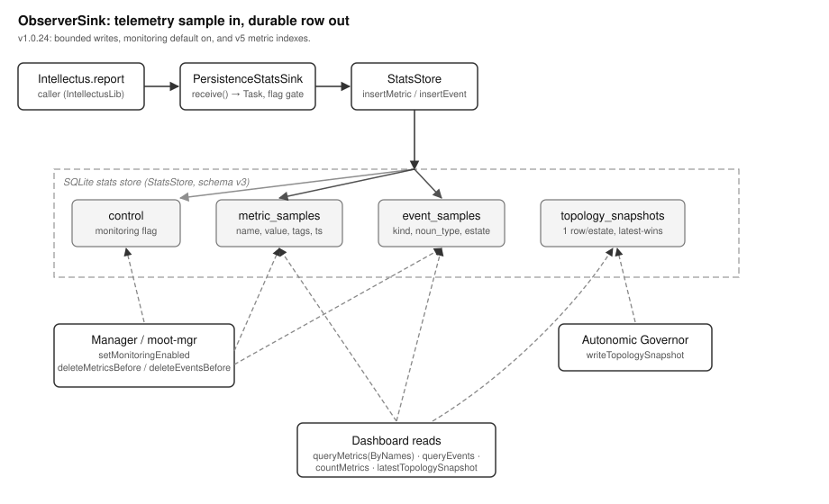

# ObserverSink Overview

## What This Library Does

ObserverSink records telemetry for the MOOTx01 manager pipeline. Telemetry
is data that describes what a running program does. It is separate from
the memories the program stores. A companion library, IntellectusLib,
defines two shapes of telemetry. A metric is a named number, such as a
latency measurement. An event is a record that one memory row was
captured or otherwise acted on. IntellectusLib defines only the shapes
and a plug-in point. It does not know how to save anything to disk.

ObserverSink is the plug-in that saves them. It ships two pieces. The
first piece is `PersistenceStatsSink`. IntellectusLib calls it each time
new telemetry arrives. The second piece is `StatsStore`. It is a small
SQLite database, plus the code that reads and writes it. Together the two
pieces turn a stream of in-memory telemetry values into durable rows. A
separate manager process can later query those rows.

## The Problem It Solves

A running MOOTx01 process is a black box unless something records what
it does. An operator may want to know how fast captures run. An operator
may want to know how many think-cycles fired. An operator may want to
know whether a given estate behaves normally. An estate is one user's
complete memory store in MOOTx01. This kind of information needs a
durable home, because the process may restart or get inspected only
after the fact.

Writing telemetry to disk on every observation is expensive if done
carelessly. It is also dangerous if it cannot be turned off. ObserverSink
solves both problems with one mechanism: a flag row in the database
itself. Before writing anything, the sink checks whether monitoring is
switched on. The manager owns that switch. The process being observed
does not. This lets the manager enable or disable recording for every
consumer at once, with no restart required. The source comments describe
this flag-row signal as Bob's confirmed choice for Manager 1.0.

The library also has to work without slowing down the code it observes.
`receive(_:)` is the method IntellectusLib calls. It must return
immediately, because it may run on time-sensitive code paths. ObserverSink
meets this requirement in a simple way. It never performs file I/O on the
calling thread. The actual database write always happens elsewhere.

## How It Works

Each telemetry value follows the same path. IntellectusLib calls
`PersistenceStatsSink.receive(_:)` with one `StatSample`. That sample is
either a `.metric` case or an `.event` case. The sink captures what it
needs and starts a background task. It then returns right away. The
calling code never waits for the database write to finish.

Inside that background task, the sink first asks the store whether
monitoring is enabled. This is a database read, but a cheap one. The
`control` table holds only a handful of rows. If the flag is off, the
sample is dropped and nothing else happens. If the flag is on, the sink
asks the store to save the sample in the correct table. A `.metric`
sample goes into `metric_samples`. A `.event` sample goes into
`event_samples`. If the write fails for any reason, the sink logs the
error and swallows it. A telemetry failure must never crash the program
it describes.

`StatsStore` also owns two other kinds of data, beyond metrics and
events. A `control` table holds the monitoring flag itself. It also holds
a timestamp that records when data was last rolled off through
retention. A `topology_snapshots` table holds one row per estate: the
latest picture of that estate's structure. A separate background process,
the autonomic governor, writes this picture. Dashboards ask for it and
get it back exactly as written. This table is not telemetry in the
metric or event sense. Even so, it shares the same store and the same
open-and-migrate machinery. It follows the same guiding principle too.
One writer produces the data. Many readers consume it. No history
persists beyond the latest value.

Retention keeps the two sample tables from growing without bound. The
manager periodically calls `deleteMetricsBefore(cutoff:now:)` and
`deleteEventsBefore(cutoff:now:)`. It supplies the cutoff timestamp
itself; the store never reads the system clock on its own. This keeps
the store's behavior fully determined by its caller's inputs. That
property matters for testing, and for reasoning about what a given
retention pass will do.

## How the Pieces Fit

Figure 1 shows the library's topology: its major parts and how data moves
between them.

*Figure 1. Topology of ObserverSink. A telemetry sample flows from the
caller through the sink's background task, past the monitoring-flag
gate, into the matching SQLite table. A separate flow lets the autonomic
governor publish topology snapshots that a dashboard reads back later.*

`Intellectus.report(_:)`, part of IntellectusLib, is the only caller of
`PersistenceStatsSink.receive(_:)`. The sink holds a reference to a
`StatsStore` and a `dropboxID` string. That string tags every row the
sink writes with the identity of the process that produced it. This lets
one shared store serve many concurrent consumers, for example several
`aria-mcp` process instances, without mixing up their rows. SQLite's
write-ahead log mode makes concurrent writers from separate consumers
safe, with no extra locking needed in this library.

`StatsStore` wraps a `SQLiteStorage` value supplied by PersistenceKit. That
kit provides the schema-declaration and row-storage machinery this
library builds on. `StatsStore` never talks to SQLite directly. It
describes its four tables as a `SchemaDeclaration` and lets PersistenceKit
create, migrate, and query them.

## What Ships in the Package

The package ships two Swift source files, `PersistenceStatsSink.swift`
and `StatsStore.swift`, plus a Rust port in `rust/`. The Rust port
reimplements the same schema and the same sink logic for consumers that
are not written in Swift. Parallel conformance test suites exercise both
legs: `Tests/ObserverSinkTests` for Swift, `rust/tests/conformance.rs` for
Rust. Both suites check the same sixteen scenarios. These cover the
schema version, control-row seeding, the monitoring flag, and metric and
event round-trips. They also cover retention roll-off, tag encoding, and
topology-snapshot reads and writes. This package pins no data artifacts.
Every table starts empty and fills only as the processes that use it
run.
